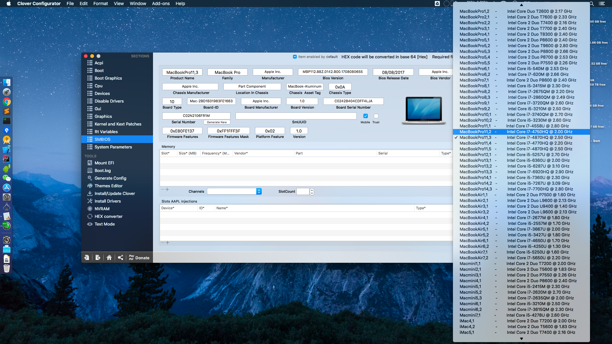

## CP65S Sager NP8650 / Clevo P650SA/SE 

### latest supported OS version
 

### current issues:

1. ~~brightness value not persist among restarts~~ fixed by removed clover brightness setting

2. ~~audio card not working ( won't boot once AppleALC enabled, if hotpatch enabled gives resources not ready, if without hotpatch, repeating message:  codec property missing, skipping )~~ fixed by applying HPET patch and using my own layout id (31), it has also been merged into main stream AppleALC

3. ~~usb states messed up after sleep~~ fixed with SSDT hotpatch

4. ~~instant wake: Wake reason: GLAN. fixed USB cut off after wake.~~
~~sleep is now working, however we won't be able to wake up on mouse/keyboard press, it's no big deal but I'll try to fix it when i have the time.~~
wake up by keyboard should be working now(?), but mouse is still no go

5. ~~https://www.tonymacx86.com/threads/guide-laptop-backlight-control-using-applebacklightinjector-kext.218222/page-89#post-1575595~~

6. Unable to turn bluetooth on&off (no solution just yet)

7. rebooting from windows may mute headphone jack output (line out still work fine, may need the help of EAPD-Codec-Commander) [WiP] 

8. ~~hibernation (sleep works fine, you can test by sleep after ```sudo pmset -a hibernatemode 25 && sudo pmset -a autopoweroff 1```)~~
   hibernation now works but ram frequency still wrong, may be a clover issue
   
9. ~~The second mini display port is not working, however the first one and HDMI are both working~~ all graphic ports are working well since release 1.2.3 (Haven't get the time for audio fixes yet)
 
10. 10.13.3 Beta (17D25b) seems to break brightness adjust ability.

11. You tell me. Any bug report is welcomed

-------

### Notes: 

1. Change to EFI boot in bios setting and GPT disk partition format. (It's long over-due if you haven't used them already)

2. To open boot menu when boot, click F7, to re-order boot priority you can either do it via bios (f2) or via efi shell bcfg(?)(forgot what the actual command is but google is your friend)
 
3. Everything should work out-of-box, however, if you are greeted by garbled screen (especially on install/recovery/10.13) you can try close your lcd and reopen it (thus put to sleep briefly) or Fn+F12, or try a different ig-platform (this will probably not happen anymore if you are using my config.plist)

4. As for imessage/face time, you are on your own. There're plenty of guides online.

5. Stock wifi card(RTL87223BE) is not supported by Mac OS, there's no solution for it yet. Find a supported one or grab a usb wifi

6. copy CP65S/VIDEO_PORTS_HDMI_DP/DisplayVendor/3840x2160/DisplayVendorID-30e4 to /System/Library/Displays/Contents/Resources/Overrides/ (if we have the same display panel, but probably not) and pair with RDM to enable hidpi display (and many other resolutions) if that's your sort of thing.  However, using this method requires you to inject your own monitor EDID into both clover and DisplayVendorID file, otherwise you may experience some issue that the internal lcd not light up after sleep, however your desktop can be accessed via remote desktop. P.S. best resolution for me personally is 2240*1260

7. !! please use clover to regenerate your serial numbers etc.
    

-------

Needs testing:

1. External display Audio

-------

#### change log:
* 1.2.3
    * switching to ig-platform 0x260d0007, which enables all the ports
    * audio layout-id injection moved into SSDT
* 1.2.2:
    * patched AppleIntelFramebufferAzul to enable HDMI and one of the DP (tested on 10.13.3 beta 17D20a, may and may not be future-proof). The disabled items under KextsToPatch are still WIP and for experiment only, do not enable them unless you are certain of what you are doing.
    * battery FirstPollDelay 5 seconds
    * updated kexts and clover (r4358) (you can manually launch CLOVERX64_old.efi for an older version)
* 1.2.1:
    * update to clover version r4319
    * remove hard coded EDID, and apply my clover patch to patch EDID automatically for fixing second stage boot screen garble issue (HorizontalSyncPulseWidth 100, 32, 35 etc, VideoInputSignal 165 (0xA5)) [link](https://www.tonymacx86.com/threads/modified-clover-with-edid-patch-to-fix-boot-second-stage-garbled-screen.238918/)
    * Updated kext to the latest release to date (AppleALC, Lilu, Shiki)


Device list:
[AIDA64 Reports - Devices](dump/AIDA64Reports/Devices.htm)
[AIDA64 Reports - APIC](dump/AIDA64Reports/APIC.txt)
[AIDA64 Reports - Motherboard](dump/AIDA64Reports/Motherboard.htm)

* 0:100  0:000  PCI (00|00:00.00) : 8086 0C04 class=060000
* 0:100  0:000  PCI (00|00:01.00) : 8086 0C01 class=060400
* 0:100  0:000  PCI (00|01:00.00) : 10DE 13D9 class=030200
* 0:100  0:000  PCI (00|00:02.00) : 8086 0416 class=030000
* 0:100  0:000   - GFX: Model=Intel HD Graphics 4600 (Intel)
* 0:100  0:000  PCI (00|00:03.00) : 8086 0C0C class=040300
* 0:100  0:000  PCI (00|00:04.00) : 8086 0C03 class=118000
* 0:100  0:000  PCI (00|00:07.00) : 8086 0C07 class=110100
* 0:100  0:000  PCI (00|00:14.00) : 8086 8C31 class=0C0330
* 0:100  0:000  PCI (00|00:16.00) : 8086 8C3A class=078000
* 0:100  0:000  PCI (00|00:16.01) : FFFF FFFF class=FFFFFF
* 0:100  0:000  PCI (00|00:1A.00) : 8086 8C2D class=0C0320
* 0:100  0:000  PCI (00|00:1B.00) : 8086 8C20 class=040300
* 0:100  0:000  PCI (00|00:1C.00) : 8086 8C10 class=060400
* 0:100  0:000  PCI (00|00:1C.04) : 8086 8C18 class=060400
* 0:100  0:000  PCI (00|03:00.00) : 10EC 5287 class=FF0000
* 0:100  0:000  PCI (00|03:00.01) : 10EC 8168 class=020000
* 0:100  0:000   - LAN: 0 Vendor=Realtek
* 0:100  0:000  PCI (00|00:1C.05) : 8086 8C1A class=060400
* 0:100  0:000  PCI (00|04:00.00) : 10EC B723 class=028000
* 0:100  0:000   - WIFI: Vendor=Realtek
* 0:100  0:000  PCI (00|00:1D.00) : 8086 8C26 class=0C0320
* 0:100  0:000  PCI (00|00:1F.00) : 8086 8C4B class=060100
* 0:100  0:000  PCI (00|00:1F.02) : 8086 8C03 class=010601
* 0:100  0:000  PCI (00|00:1F.03) : 8086 8C22 class=0C0500
INT340E

| ACPI Path | _HID | _CID | DeviceID/VenderID | Description | IRQ | Link |
| :-: | :-: | :-: | :-: | :-: | :-: | :-: |
| _SB/CAT | N/A | PNPC000 | N/A | Clevo Airplane mode ? |
| _SB/IFFS | INT3392  | PNP0C02 | N/A | Intel(R) Rapid Start Technology Device |
| _SB/INSD | INT3398  | PNP0C02 | N/A | Intel(R) Ready Mode Technology Device | [link](https://www.intel.com/content/www/us/en/architecture-and-technology/intel-ready-mode-technology.html) |
| _SB/PTID | INT340E  | PNP0C02 | N/A | Intel(R) Management Engine Interface? | [link](#) |
| _SB/LID0 | N/A | PNP0C0D | N/A | ACPI Lid | [link](#) |
| _SB/PWRB | N/A | PNP0C0C | N/A | ACPI Power Button | [link](#) |
| _SB/SLPB | N/A | PNP0C0E | N/A | ACPI Sleep Button | [link](#) |
| _SB/DMAC | N/A | PNP0200 | N/A | Direct memory access controller | [link](#) |
| _SB/HPET | N/A | PNP0103 | N/A | High precision event timer | [link](#) |
| N/A | N/A | N/A | ACPI\VEN_INT&DEV_3398 | Motherboard resources | [link](#) |
| N/A | N/A | N/A | ACPI\VEN_PNP&DEV_0C04 | Numeric data processor | [link](#) |
| N/A | N/A | N/A | ACPI\VEN_PNP&DEV_0000 | Programmable interrupt controller | [link](#) |
| N/A | N/A | N/A | ACPI\VEN_PNP&DEV_0B00 | System CMOS/real time clock | [link](#) |
| N/A | N/A | N/A | ACPI\VEN_PNP&DEV_0100 | System timer | [link](#) |
| ? | N/A | N/A | VEN_8086/DEV_8C20 | Intel Lynx Point PCH - High Definition Audio Controller [C-1] | [link](#) |
| ? | N/A | N/A | VEN_INT&DEV_340F | Intel Collaborative Processor Performance Control (CPPC) Driver | [link](#) |
| ? | N/A | N/A | PCI\VEN_8086&DEV_8C10&SUBSYS_65571558&REV_D4 | Intel(R) 8 Series/C220 Series PCI Express Root Port #1 - 8C10 | [link](#) | 131071 |
| ? | N/A| N/A | PCI\VEN_8086&DEV_8C18&SUBSYS_65571558&REV_D4 | Intel(R) 8 Series/C220 Series PCI Express Root Port #5 - 8C18 | [link](#) | 131071 |
| ? | N/A | N/A | PCI\VEN_8086&DEV_8C1A&SUBSYS_65571558&REV_D4 | Intel(R) 8 Series/C220 Series PCI Express Root Port #6 - 8C1A | [link](#) | 131071 |
| ? | N/A| N/A | PCI\VEN_8086&DEV_8C22&SUBSYS_65571558&REV_04 | 	Intel(R) 8 Series/C220 Series SMBus Controller - 8C22 | [link](#) | N/A |
| ? | N/A| N/A | PCI\VEN_8086&DEV_8C24&SUBSYS_65571558&REV_04 | 	Intel(R) 8 Series/C220 Series Thermal - 8C24 | [link](#) | N/A |
| ? | N/A| N/A | PCI\VEN_8086&DEV_8C4B&SUBSYS_65571558&REV_04 | 	Intel HM87 Chipset - LPC Interface Controller - 8C4B | [link](#) | N/A |
| ? | N/A| N/A | PCI\VEN_8086&DEV_8C3A&SUBSYS_65571558&REV_04 | 	Intel Lynx Point PCH - Host Embedded Controller Interface 1 (HECI1) [C-1] Intel(R) Management Engine Interface | [link](#) | 65536 |
| ? | N/A| N/A | PCI\VEN_8086&DEV_8C26&SUBSYS_65571558&REV_04 | 	Intel Lynx Point PCH - USB 2.0 EHCI Host Controller 1 | [link](#) | 23 |
| ? | N/A| N/A | PCI\VEN_8086&DEV_8C2D&SUBSYS_65571558&REV_04 | 	Intel Lynx Point PCH - USB 2.0 EHCI Host Controller 2 | [link](#) | 16 |
| ? | N/A| N/A | PCI\VEN_8086&DEV_8C31&SUBSYS_65571558&REV_04 | 	Intel Lynx Point PCH - USB 3.0 xHCI Host Controller [C-1] | [link](#) | 65536 |


-------
the hardest part is probably getting audio card working, including my pinconfig/pathmap etc.

apparently, Mac only uses pinconfig sort of as a reference, and not really stick to it. pathmap has its influence over what "system information" -> "audio" says as well.


-------
graphic patch notes:
[guide](https://www.tonymacx86.com/threads/guide-intel-igpu-hdmi-dp-audio-sandy-ivy-haswell-broadwell-skylake.189495/)

1. AppleIntelFramebuffer 0:      LCD0
2. AppleIntelFramebuffer 1: 0105 HDMI
3. AppleIntelFramebuffer 2: 0204 DP 
4. AppleIntelFramebuffer 3: 0306 DP <01 00 00 00> -> <00 04 00 00>


| Connector | Data |
| :-: | :-: |
| HDMI | 00 08 00 00 |
| DVI-I | 00 02 00 00 |
| eDP/DVI-DL | 00 04 00 00 |
| DP | 00 04 00 00 |
| LVDS | 02 00 00 00 |
| Thunderbolt? | 00 0C 00 00 |
| S-V | 08 00 00 00 |
| VGA | 10 00 00 00; 00 10 00 00; 00 01 00 00; 01 00 00 00 |

from current ioreg:
| connector type | index |
| :-: | :-: |
| CRT0 @ 100 | 
| DP @ 303 |
| HDMI @ 304 |
| LCD0 @ 410 |
| PNLF @ 0 |


* four connectors in total: 100* (internal display), 0105 (HDMI), 303 401* (DP)
* LCD0/DVI connectors connector-type <00 02 00 00> (internal display)
* DP connectors connector-type <00 04 00 00> 
* HDMI connectors connector-type <00 08 00 00>


* IOACPIPlane:/_SB/PCI0@0/IGPU@20000/CRT0@100
* IOACPIPlane:/_SB/PCI0@0/IGPU@20000/DP@303
* IOACPIPlane:/_SB/PCI0@0/IGPU@20000/HDMI@304
* IOACPIPlane:/_SB/PCI0@0/IGPU@20000/LCD0@410


=============
`derek-mac:~ derek$ pmset -g
System-wide power settings:
Currently in use:
 standbydelay         4000
 standby              1
 womp                 0
 halfdim              1
 hibernatefile        /var/vm/sleepimage
 powernap             0
 gpuswitch            2
 networkoversleep     0
 disksleep            10
 sleep                10 (sleep prevented by SubmitDiagInfo)
 autopoweroffdelay    5400
 hibernatemode        3
 autopoweroff         1
 ttyskeepawake        1
 displaysleep         10
 lidwake              1`


### Reference
1. [ACPI Specification](http://www.uefi.org/sites/default/files/resources/ACPI%206_2_A_Sept29.pdf)
2. [High Definition Audio Specification](https://www.intel.com/content/dam/www/public/us/en/documents/product-specifications/high-definition-audio-specification.pdf)

